# Sistema de Publicación de Eventos 
# Relacionados con Ciencia de la Computación

## Integrantes:

- Béjar Román, Edson Bryan

- Béjar Román, Katherine Nikole

- Suni Quispe, Yanira Angie

## Propósito del proyecto

El propósito de este proyecto es realizar una página web que nos muestre los
eventos relacionados con "Ciencia de la computación" , con esta página web podremos tener un sistema de consulta, registro y creación 
de eventos relacionados con la computación, los usuarios tendrán la oportunidad de informarse sobre más eventos tecnológicos, 
al mismo tiempo que podrán registrarse si alguno de ellos es de su interés, incluso los organizadores de eventos podrán publicitar
su evento en nuestra página web para que tenga mayor alcance. 

## Funcionalidades
Se muestra la página web con publicaciones de eventos próximos relacionados a Ciencia de la Computación, donde cualquier usuario puede acceder y ver el título, el nombre del ponente, y una breve descripción sin poder modificarlo.
En la parte superior derecha podemos observar dos botones, donde el usuario podrá registrarse o, si es que ya lo hizo, iniciar sesión.

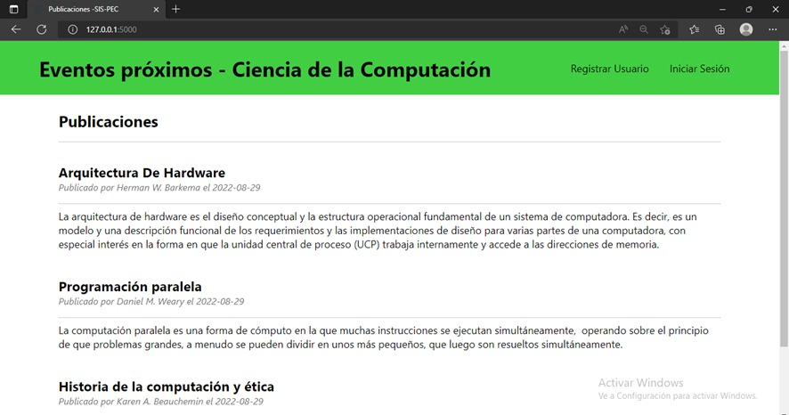

Al momento de apretar el botón de registrarse, tenemos que llenar nuestros datos, los cuales son el nombre de usuario y la contraseña como se muestra en la figura.

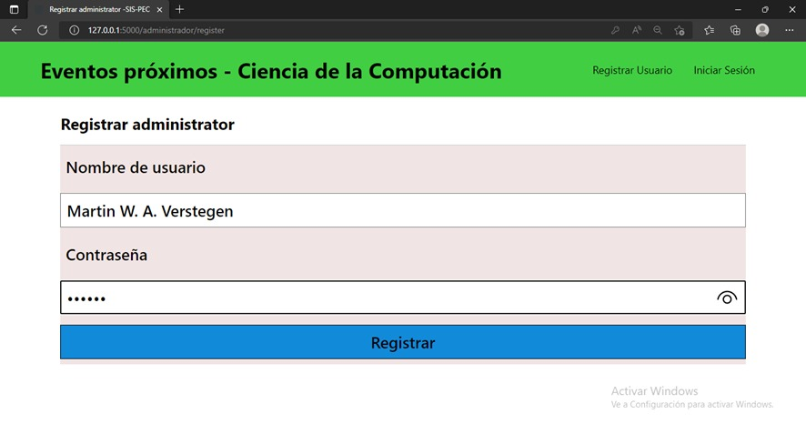

Luego de haber hecho el registro exitosamente, nos llevará a la página de iniciar sesión y se tendrá que poner los mismos datos con los que se registró anteriormente.

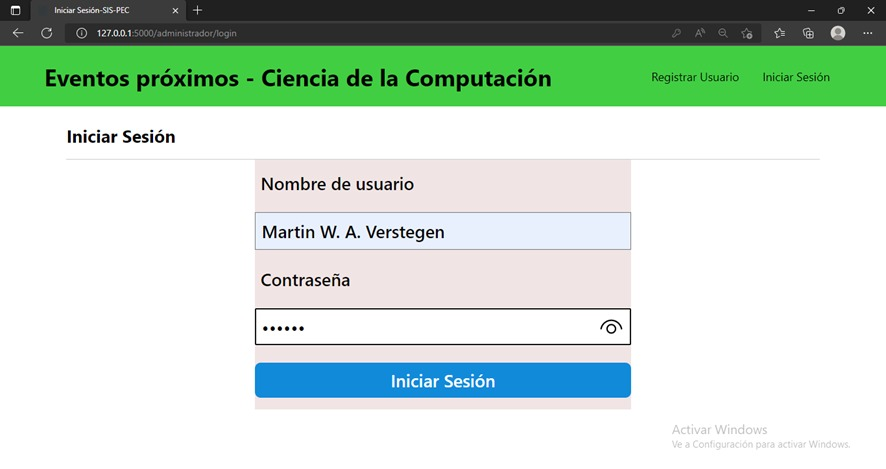

Ya al iniciar sesión el usuario podrá añadir una o varias publicaciones; en el caso de haber tenido un error puede modificarlas o por defecto eliminarlos.

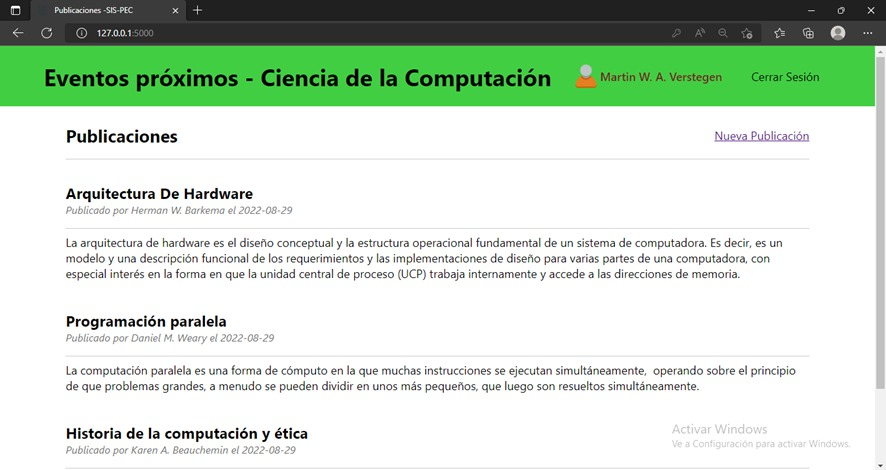

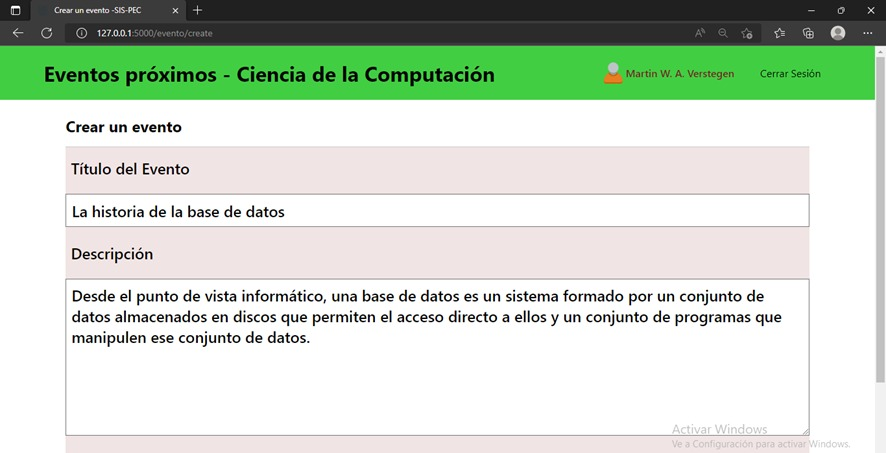

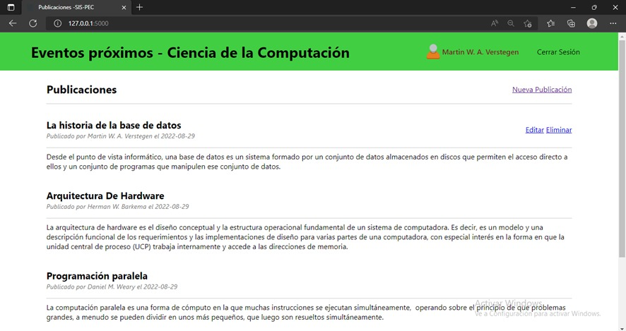

## Prácticas de código legible aplicadas

### 1. Comentarios y documentación 

    Comentar el código es de mucha utilidad hoy en día porque permite entender mejor la funcionalidad del mismo para que
    demás desarrolladores puedan utilizarlo de diferentes maneras. 
    Un ejemplo en nuestro código es el siguiente:
    
  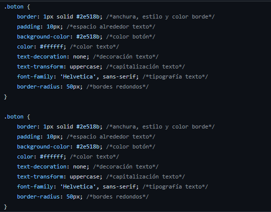
    
### 2. Sangría consistente 

    Las sangrías ayudan a mantener un orden visual para mayor entendimiento.
    Un ejemplo en nuestro código es el siguiente:
    
  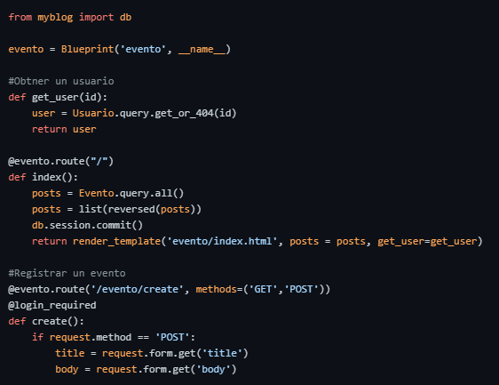
    
 ### 3. Agrupación de códigos 

    En ocasiones un conjunto de tareas no ocupa mucha realización de código.
    Por lo que es recomendable mantenerlos en bloques para localizarlos mas rápido.
    Un ejemplo en nuestro código es el siguiente:
    
  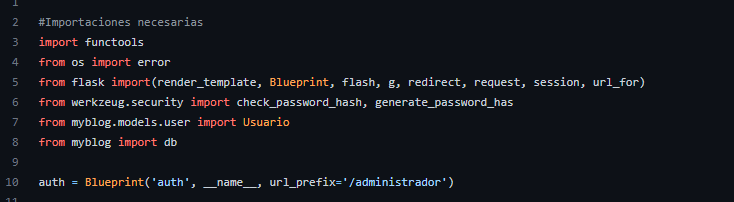   
    

  ### 4. Esquema con nombres coherentes

    Los nombres deben tener límites de palabras para ello se usa el subquión 
    o mayúsculas.
    Un ejemplo en nuestro codigo es el siguiente:
    
  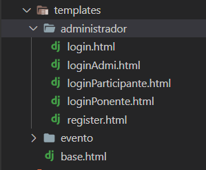   
  
  
  ### 5. Límite de longitud de línea

    Es mejor tener un límite de línea que una línea extensa de código de
    difícil legibilidad.
    Un ejemplo en nuestro código es el siguiente:
    
  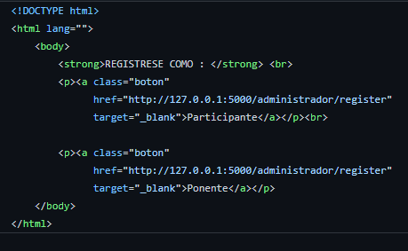   
    
    
   ### 6. Evite el anidamiento profundo

    Demasiados niveles de anidamiento hacen que el código sea menos legible
    Un ejemplo en nuestro código es el siguiente:
    
  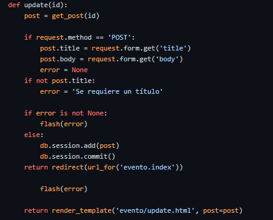 

## Estilos de programación aplicados

### 1. CookBook 

    Para realizar una acción se dividen las subtareas en funciones más pequeñas
    y al final se juntan para resolver un mismo objetivo.
    Un ejemplo en nuestro código es el siguiente:
    
  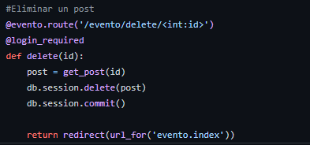

### 2. Programación orientada a objetos

    Una forma mas fácil de manejar un escenario con muchas partes es crear objetos
    que nos permitan un mejor manejo y estructuración de nuestro escenario. 
    Un ejemplo en nuestro código es el siguiente:
    
  
  
  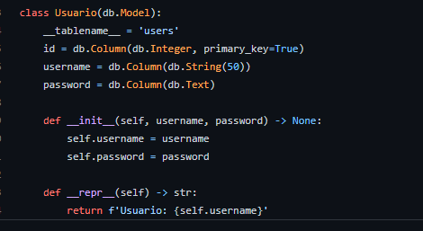

### 3. Trinity

    La aplicación se divide en tres componentes que son el modelo, la vista y
    el controlador. 
    Un ejemplo en nuestro código es el siguiente:
    
  

## Principios SOLID aplicados

### 1. Principio de inversión de dependencias 
    
    Un modo de emplear este principio es cuando para un servicio web utilizamos conexión a base de datos,
    es mejor colocar en un archivo o función aparte las configuraciones de la conexión de base de datos,
    para así evitar modificar adicionales líneas de código donde hacemos uso de la base de datos.
    Un ejemplo en nuestro código es el siguiente:
    
  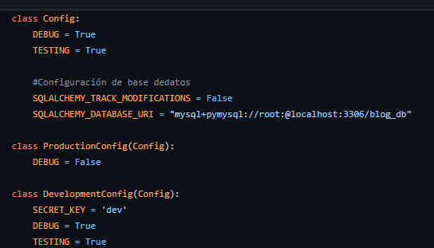
  
### 2. Principio abierto/cerrado
    
    En el proyecto se tiene la opción de agregar evento lo cual representa a la parte de abierto del principio, pero además 
    muestra todos los eventos que hay sin necesidad de modificar la parte del código que lo muestra, pues se utiliza una 
    iteración, lo que representa la parte de cerrado del principio.
    Como se muestra a continuación:
    
    -OPEN: Agregar evento
   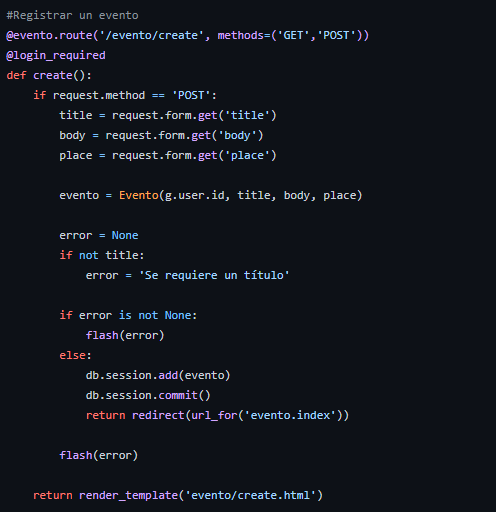
   
    -CLOSE: Mostrar eventos
   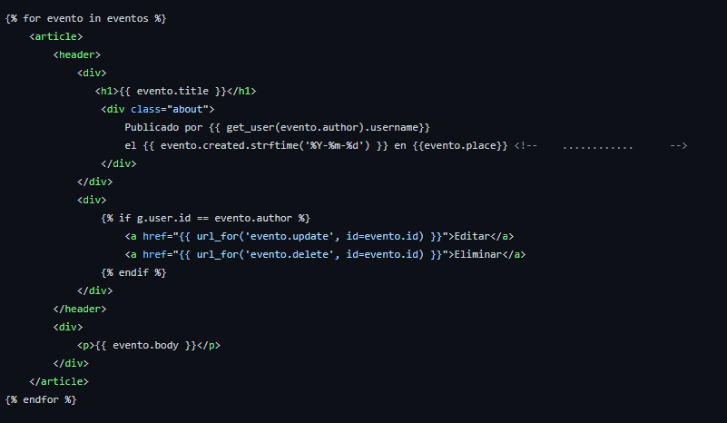
    
   
## Aportes del grupo

### Edson Béjar Román:

- Template de Evento
- Modelo Evento
- Controlador evento 

### Katherine Bejar Roman:

- Realización de la conexión de base de datos.
- Diseño CSS
- Template administrador
- Modelo administrador

### Yanira Suni Quispe:
- Template de Ponente
- Modelo User
- Control del login

